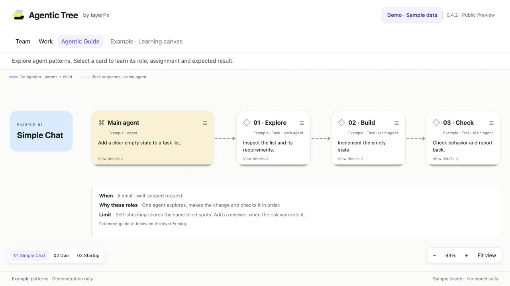

# Agentic Tree by layerPx

Free plugin for DeepSeek Harness to visualize agent teams, delegation, and runs.

## Public Preview — v0.4.2

Agentic Tree **0.4.2** is published as a **Public Preview** pre-release: [Release v0.4.2](https://github.com/avery-tech/agentic-tree/releases/tag/v0.4.2). The repository is live at https://github.com/avery-tech/agentic-tree. Verified compatibility: **DeepSeek Harness 0.2.0-rc.2 only**; other Harness versions are unverified. The independent installation check of this preview is still pending.

**Download and install v0.4.2.** Open [Release v0.4.2](https://github.com/avery-tech/agentic-tree/releases/tag/v0.4.2) → **Assets** and download both `layerpx-harness-agent-viewer-0.4.2.tgz` and `SHA256SUMS`, then verify the archive:

```sh
shasum -a 256 -c SHA256SUMS
```

`SHA256SUMS` expects `27dc75aef1d657155fb88510d2a6b94155786e0d5fd897e3949ffebe0786a5d6`. Install the archive through **Plugins → Add plugin**, selecting the downloaded `.tgz` by its absolute path, or with the Harness-managed CLI:

```sh
dsh plugin --profile <profile> add /absolute/path/to/layerpx-harness-agent-viewer-0.4.2.tgz
```

Then restart Harness, open an existing conversation and select **Agentic Tree** beside **Chat** and **Trajectory**. Install the **attached `.tgz` from the release assets** — not the automatic GitHub "Source code" archives, which are source snapshots rather than the installable package. The package keeps `private: true` and is not distributed through the npm registry.


**See how HQ delegates work to Developer and Reviewer.** 

**Watch the 26-second demo**


https://github.com/user-attachments/assets/af0125d5-406d-4a81-8cb5-fc52f7e9c16e

The pictures and the video show **sample (training) data** rendered by the **0.4.2** components: they are not a record of a real session and no model calls are made to display them. Every frame carries the **Demo · Sample data** badge. These files are documentation only and are not part of the installation archive.

**Agentic Tree** is a standalone free product under the **layerPx** brand. It helps you see the structure of an AI-agent team, delegation relationships, individual runs and their state inside the current Harness session.

It grew out of work on the layerPx planner and uses its visual approach to organizing work: cards, branches and an explorable canvas. Its current capabilities are observation and interactive learning. Launching agents from layerPx and transferring results into layerPx boards are future ideas, not available integrations.

## Product passport

| Field | Accepted positioning |
|---|---|
| Name / application tab | Agentic Tree |
| Full public name | Agentic Tree by layerPx |
| Product | Standalone free product under the layerPx brand |
| Release lead and responsible person for releases | Vitaly Averyanov |
| GitHub repository owner | avery-tech |
| Comito | A public AI character of layerPx who tells the story of the development and the updates; responsibility for a release rests with Vitaly Averyanov |
| License | Apache-2.0 for the code of this repository |
| Legal rights holder | Vitaly Averyanov |

Destinations:

- Repository — **live**: https://github.com/avery-tech/agentic-tree
- Product page — **planned**: https://layerpx.com/agentic-tree

## Brand and naming

The names **Agentic Tree** and **Agentic Tree by layerPx**, and the layered mark in the interface, identify the official version — the build released by Vitaly Averyanov from the channels above. The code stays Apache-2.0: these rules cover names and the mark only, do not restrict or extend the license, and add no advertising requirement.

- Personal use and local changes need no renaming. An ordinary GitHub fork for study or a fix may keep the name and the logo files when it states its origin and claims no official status.
- A modified build distributed publicly as its own product uses its own name and logo instead of the official branding; stating "Based on Agentic Tree by layerPx" is correct and welcome.
- Unmodified official archives may be passed on with their branding and source; reviews, articles and screenshots of the product are allowed.
- Technical identifiers such as `@layerpx/harness-agent-viewer` and `layerpxObserver` are compatibility names, not the product's public designation.

The full rules are in [TRADEMARK.md](TRADEMARK.md).

## Current version and availability

**Current public version: v0.4.2 — Public Preview, marked as a pre-release. Verified compatibility: DeepSeek Harness 0.2.0-rc.2 only**, with compatibility checks enabled and no exemptions. Other Harness versions are unverified. The independent installation check of v0.4.2 is pending; the last build with a completed local installation check is v0.4.1.

The v0.4.2 archive is distributed from the release assets above, and the repository and the tag `v0.4.2` are live; the product page is still planned. The source package keeps `private: true` as a guard against accidental publication to the npm registry; it does not restrict the license. Free pricing does not place the product under an open-source license by itself — the separate License section below states the terms. The plugin needs no additional API key or model connection; it does not change Harness or model-provider charges.

The frozen builds v0.1.0–v0.4.1 carry the earlier `license: UNLICENSED` metadata and are left unchanged. The licensing metadata, the brand rules and the version described here take effect in the v0.4.2 build.

v0.4.2 changes documentation and packaging metadata only, with no behaviour change: it adds [TRADEMARK.md](TRADEMARK.md) as the brand document, ships it in the archive, states the licensing and brand position in the public documents and moves the version to 0.4.2. The version history and the scope of each verification round are recorded in [CHANGELOG.md](CHANGELOG.md).

## License

The code of the rights holder in this repository is released under the **Apache License 2.0** by the decision of the rights holder, **Vitaly Averyanov**. That permission also covers **his own code moved into this plugin from the layerPx and Vibe Coding Box projects**. The full text is in [LICENSE](LICENSE) and the attribution statement is in [NOTICE](NOTICE). Copyright 2026 Vitaly Averyanov.

- **Third-party components keep their own licenses.** The release package bundles npm dependencies and one further non-owner item — an inlined icon; every one is listed in [THIRD_PARTY_NOTICES.md](THIRD_PARTY_NOTICES.md) with its version, license and full license text. Third-party material is **not** covered by the owner's permission above.
- **The inlined token icon is third-party.** The `coins` glyph in the token indicator is the Lucide `coins` icon (ISC, portions Feather/MIT), carried over with the donor code from the Vibe Coding Box project rather than authored here. Its license text is in the notice file and its provenance is recorded in [PROVENANCE.md](PROVENANCE.md).
- **The main layerPx product is not covered.** The closed layerPx planner remains proprietary; this license applies only to this plugin repository.
- **Trademarks are not licensed.** Apache-2.0 §6 does not grant rights to the names **layerPx** or **Agentic Tree by layerPx**, or to the layered mark used in the interface, beyond customary reference to the origin of the work. [TRADEMARK.md](TRADEMARK.md) states how those names and the mark may be used and what is not restricted — it does not limit the license.
- Some bundled assets have provenance worth reading before publication: see the dated licensing section in [PROVENANCE.md](PROVENANCE.md).

## Three views

Open an existing conversation and select **Agentic Tree** beside **Chat** and **Trajectory**.

| View | What it shows |
|---|---|
| **Team** | The selected session and its descendant agent sessions, with parent/child delegation links and collapsible branches. |
| **Work** | Individual native executions, owned background jobs and their state. Repeated runs of an agent appear as separate cards on its lane; the view opens by default. |
| **Agentic Guide** | Interactive example schemes with explanations: Simple Chat, Duo and Startup. Example data are separate from the current session. |


**Work** — Follow separate runs, from completed work to the next active step.



**Agentic Guide** — Explore sample agent patterns with roles, tasks and practical limits.

Click a real agent/run card to inspect its assignment, recorded model/preset, status, duration, executions, tool calls and available event input/results. Pan, zoom or use **Fit view**. The root is labeled **HQ (Main agent)** in the Guide; the observed root card uses **HQ**.

In Work, positions run from earlier to later in compressed minute groups, not a proportional time scale. Position alone does not prove a handoff. HQ remains one session anchor. Work renders delegation links where matching parent nodes are available; use Team and the Parent field to inspect nested parentage.

**◉ Live** is a latched camera mode in Work: it centers the freshest running agent card, then a running background job at **56%** zoom, or the latest recorded activity when no card is running. Manual pan, zoom or Fit view stops following; disconnection pauses it and reconnection resumes it. It holds each target for at least 3 seconds before choosing the latest candidate, without replaying a queue. A 2-second Soft glow marks focus/activity. It starts off when reopening Work. The separate top-right Live indicator describes connection health.

Connections use the approved palette: running targets are thick purple, completed targets are subtle solid grey hairlines, and other states use a regular grey line. Selecting a card emphasizes its connection.

## What the data means

- **Identity and role:** HQ is the root; descendants receive stable per-chat viewer identities such as Agent 3. An optional role is recognized conservatively from the initial assignment. Unrecognized roles retain Agent N. Names do not create agents or establish their permissions. See [Viewer roles](docs/VIEWER-ROLES.md). Numbers persist in this client's local storage; clearing it resets aliases, and different clients may number agents differently.
- **Assignment title:** the recorded child/session title, which may describe an earlier assignment. Details exposes the selected execution's available assignment text. Preset, role and actual model remain separate fields.
- **Elapsed / Last event:** recorded execution duration and age of the relevant durable event, not cumulative lifetime or proof that an agent is stuck. Clock skew can affect ages. Running requires the Host's live summary; an unclosed historical turn alone remains Unknown.
- **Tokens:** provider-reported session totals across runs, including cache buckets. They are not dollar costs or per-run totals. Repeated run cards repeat the same labeled total and must not be summed. Missing usage is shown as unavailable.
- **Errors:** a failed tool call remains distinct from the final outcome of an execution.
- **Sprout progress:** the selected root session's native checklist. It counts completed planned steps, not time or completed agents. Up to 20 steps get individual cells; larger plans are grouped while retaining counts. Missing plans show No plan yet. Native updates can change the list; Harness rc.2 clears it at the next turn start. No plan is invented or merged across agents.

## Background jobs

Work displays native jobs owned by the selected session or its observed descendants. Agent and job counts stay separate: a Completed agent may own a Running Bash command. Click a job for its command, native status/result, owner and retained output. No stop/kill control is exposed.

Ownership is native. In Work, a job is anchored to its owner's latest visible run starting before registration (or the HQ anchor); this placement does not prove which exact tool call launched it. Jobs with no matching visible run have no invented connection.

Observation covers the first **64 agent sessions**, at most **200 jobs**, and live output for **8 jobs plus the selected job**. Harness retains a bounded output tail (up to 128 KiB UTF-16 units in the native client); gaps/errors are shown. Unowned/global jobs are excluded. Job history depends on the running host's registry and may disappear after restart or removal; this is not a durable job archive. Roster loading/failure is not separately exposed by the native service.

Output activity time means when this viewer observed an update, not the original execution time. Initial retained output and timer ticks are not new activity. A quiet running command stays Running without synthetic pulses. Disconnect freezes the last observed state; reconnect uses native subscriptions.

Removed job cards and ownership lines fade out over two seconds. Their last known state is presentation only, labeled No longer listed; they no longer affect counts or Live focus. Owner removal clears the departing card immediately.

## Interactive learning

Guide is the same style of canvas on explicitly labeled **Example** data. It shows one agent with sequential tasks, a developer delegating to a reviewer, and HQ with two developers and a reviewer plus a nested architect. Section navigation moves the camera; Fit view frames all three schemes. Comments explain when a scheme fits, why roles are arranged that way, and its limitation. Clicking a card shows a role, example assignment and expected result.

Solid purple arrows mean delegation; dashed grey arrows mean tasks performed in sequence by the same agent. These are illustrative schemes, not live session activity or executable team presets. Expanded articles are planned. Links appear only when a published article is configured; none are currently configured.

## Observer boundary and known limits

The plugin reads native Harness events/session data and does not alter the existing subagent workflow. It cannot launch, stop or prompt agents, execute their tools or change orchestration. It adds no new model connection or telemetry service.

- Summaries retain **24 executions, 80 tool calls and 40 recent events per agent**. Earlier retained native history can be inspected through Details. Text previews are capped at 320 characters; raw-event previews at 100,000 characters.
- A **1,000-agent guard** and four concurrent cold projection reads bound observation. Very large-session performance is not measured.
- Activity is based on recorded durable events, not a per-token transcript. Full payloads are read on demand for the selected agent.
- Live camera transitions and disconnect/reconnect behavior have been checked with synthetic events; full new real-work acceptance of all outcomes, populated checklists, reconnect and dark appearance remains pending. No support for other Harness versions is claimed.
- No automatic stall/loop diagnosis, export, agent controls, role editor or persisted camera/collapse preferences. No current integration for launching agents from layerPx or sending results into its boards.

## Build, verify and install locally

```sh
npm ci --ignore-scripts
npm run check
npm pack                        # writes layerpx-harness-agent-viewer-<version>.tgz into the working directory
node scripts/check-notices.mjs  # verifies THIRD_PARTY_NOTICES.md against the bundled packages and their artifacts
```

Node 22+ recommended. Harness supplies React at runtime. Exact rc.2 peer constraints remain in the package; compatibility checks must remain enabled. The v0.4.2 verification suite contains **41 automated tests**, covering the observer, background jobs and camera selection; the changelog records what each version was checked against. Test coverage does not replace the remaining real-work checks.

`scripts/check-notices.mjs` is a separate, read-only license check and is deliberately not part of `npm run check`; [RELEASING](docs/RELEASING.md) explains when to run it.

Install a package archive through **Plugins → Add plugin**, or the Harness-managed CLI:

```sh
dsh plugin --profile <profile> add /path/to/layerpx-harness-agent-viewer-0.4.2.tgz
```

Use the profile owning the session and wait until its work is idle before restarting Harness. Remove through Plugins or `dsh plugin --profile <profile> remove @layerpx/harness-agent-viewer`. The attached archive from the [Release v0.4.2](https://github.com/avery-tech/agentic-tree/releases/tag/v0.4.2) assets installs the same way as an archive you built from source; the attached `.tgz` is the installation source, not the automatic GitHub "Source code" archives. The package keeps `private: true` and is deliberately not distributed through the npm registry. The build and release sequence is in [RELEASING](docs/RELEASING.md).

The internal package name **`@layerpx/harness-agent-viewer`**, conversation view id **`layerpx-tree`**, host plugin name **`layerpx-agent-viewer`**, projection **`layerpxObserver`**, storage keys and technical paths remain unchanged.

## Architecture and extraction boundary

```text
Native Session events → pure Host projection (layerpxObserver)
                    → native session projection/control transport
Native subagentCatalog + live summary + recorded model/preset
                    → Harness read-only adapter
                    → portable GraphSnapshot
                    → LayerPx layout / curves / camera + React Flow cards
Click → native read-only history retention → Details
```

| Boundary | Implementation | Responsibility |
|---|---|---|
| Portable view contract | `src/model.ts` | Nodes, status, time; no Harness imports |
| Donor geometry | `src/donor/` | Unchanged LayerPx tree layout and camera, extracted connection curve |
| Tree renderer | `src/renderer/Tree.tsx` | Layout, cards, pan/zoom, collapse; receives data and selection callbacks |
| Harness adapter | `src/harness/` | Session isolation, native projection subscriptions, scoped history reads |
| Host observation | `src/host/` | Pure bounded event fold; skips inherited ancestor events |
| Plugin registration | `src/client.tsx`, `cordis.patch.yml` | One conversation tab and one projection; automatic disposal |

Details currently lives beside the renderer but is Harness-specific because it acquires native history. It must move with the adapter when extracting the renderer as an independent package. No LayerPx database, PowerSync, login, server, editor commands or project configuration are imported. Donor provenance is in `PROVENANCE.md`.

## Documentation and future work

- [License](LICENSE), [attribution notice](NOTICE) and [third-party notices](THIRD_PARTY_NOTICES.md): the license of this repository's own code, its attribution statement, and the licenses of the components actually bundled into the package.
- [Brand and naming rules](TRADEMARK.md): how the product names and the interface mark may be used, what stays unrestricted, and which build is the official one.
- [Viewer roles](docs/VIEWER-ROLES.md): the optional role header recognized in an initial assignment and the limits of that recognition.
- [Release procedure](docs/RELEASING.md): the checks before a release, versioning, packaging, archive verification and tagging.
- [Changelog](CHANGELOG.md) and [code provenance](PROVENANCE.md): version history, and the origin of the transferred and third-party material.

Planned and not implemented: publishing the product page at https://layerpx.com/agentic-tree, expanded Guide articles, and any integration that launches agents from layerPx or writes results back into its boards.
